# nudibranch

Colour palettes inspired by intertidal and shallow rocky reef nudibranchs and sea slugs 
photographed in NSW, Australia.

## Installation
install.packages("devtools")
devtools::install_github("nikihubbard-source/nudibranch")

## Usage
library(nudibranch)

# See all palettes
nudibranch_palette()

# Get a palette
nudibranch_palette("hypselodoris")

# Use with ggplot2
ggplot(data, aes(x, y, colour = group)) +
  scale_colour_nudibranch("hypselodoris")

## Palettes

### Hydatina
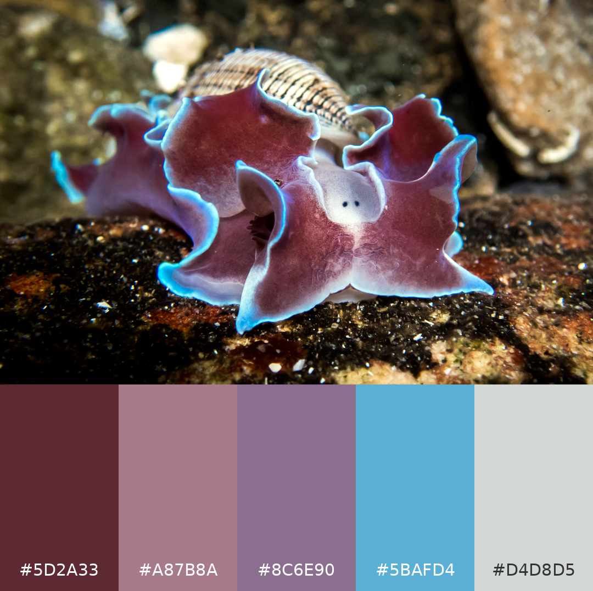

### Hypselodoris
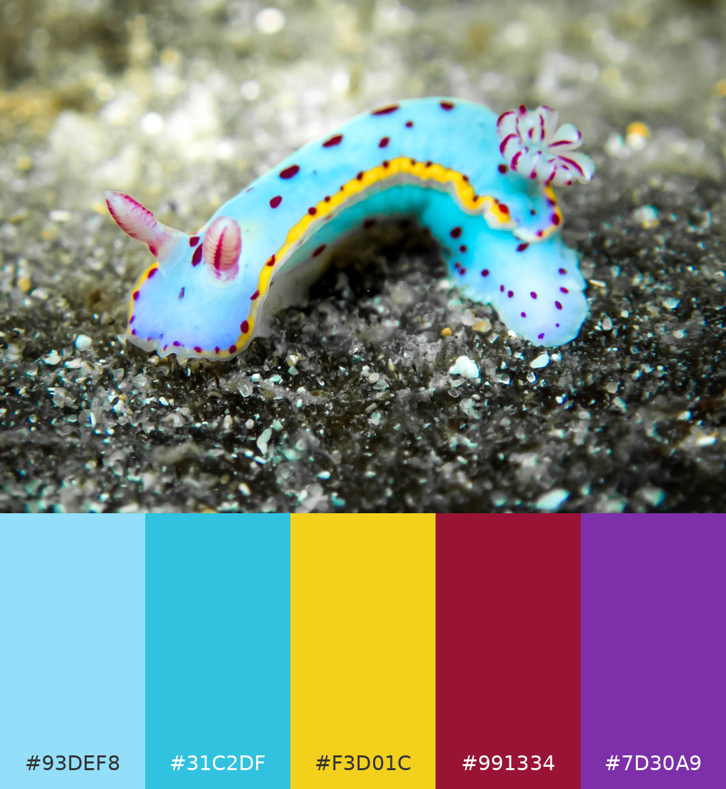

### Doriprismatica
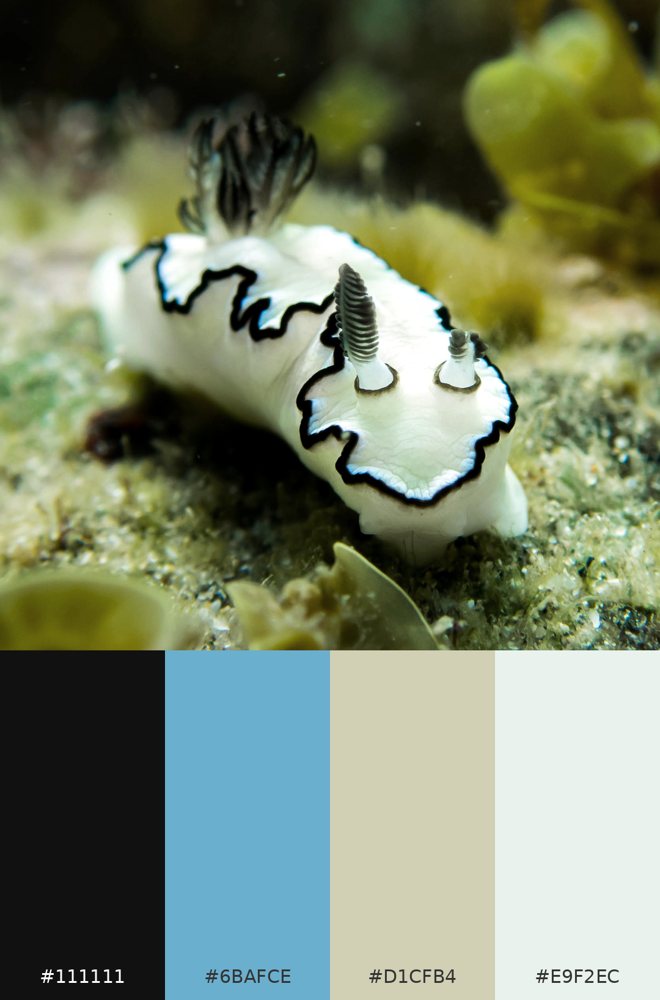

### Bullina
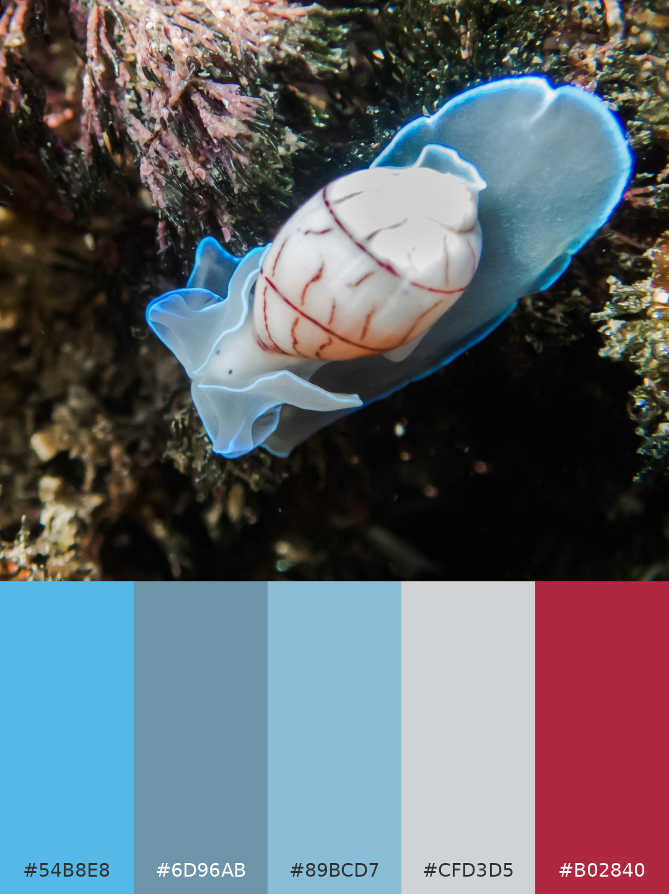

### Elysia
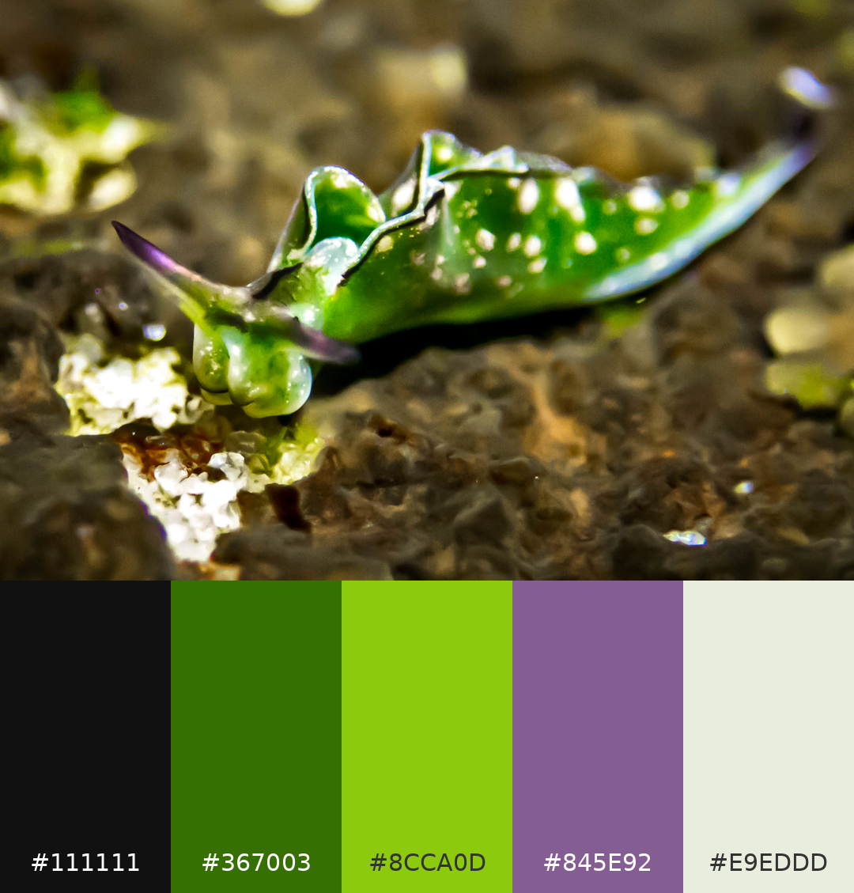

### Dolabrifera
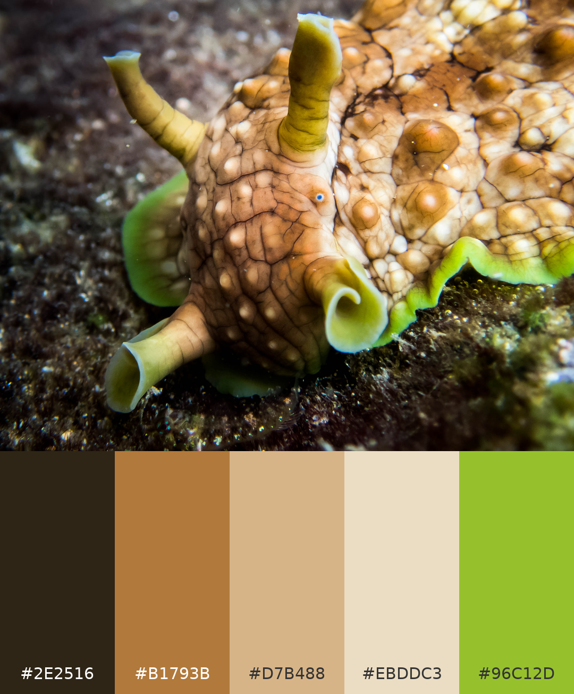

### Dendrodoris
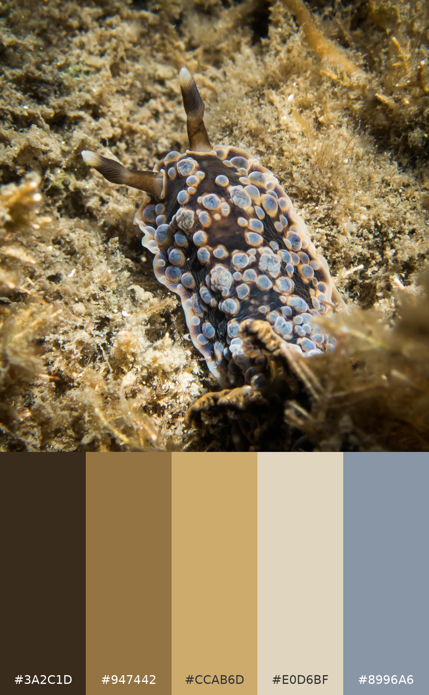

### Aplysia
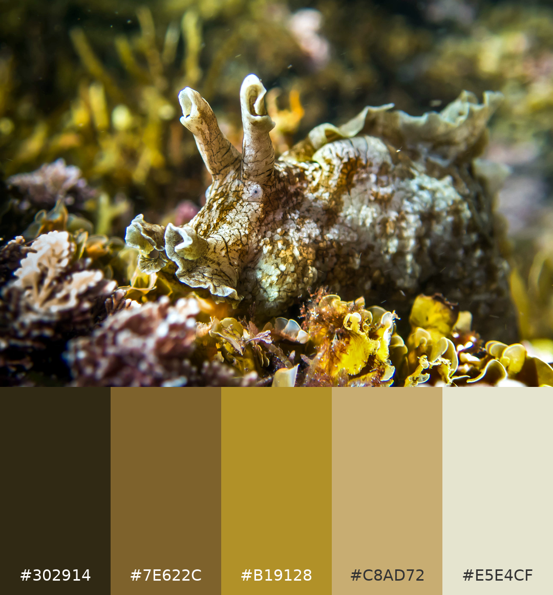

### Haloa
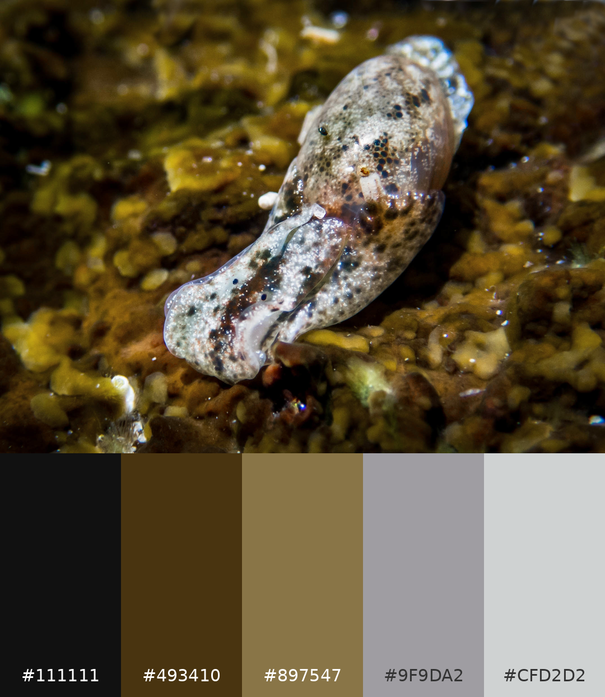

### Carminodoris
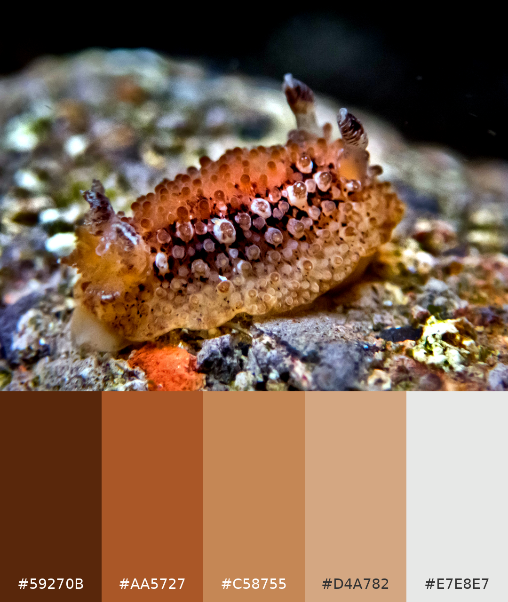

### Jorunna
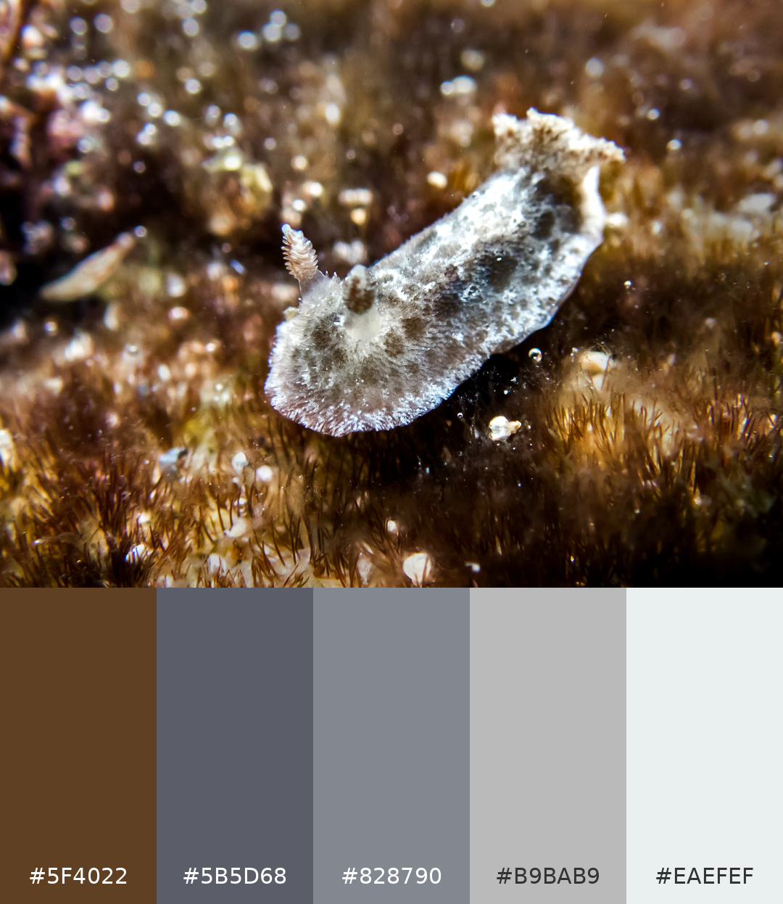

### Ceratosama
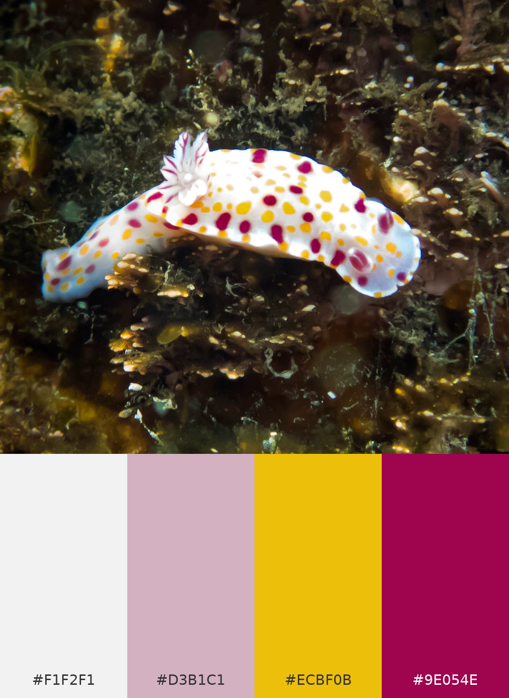
